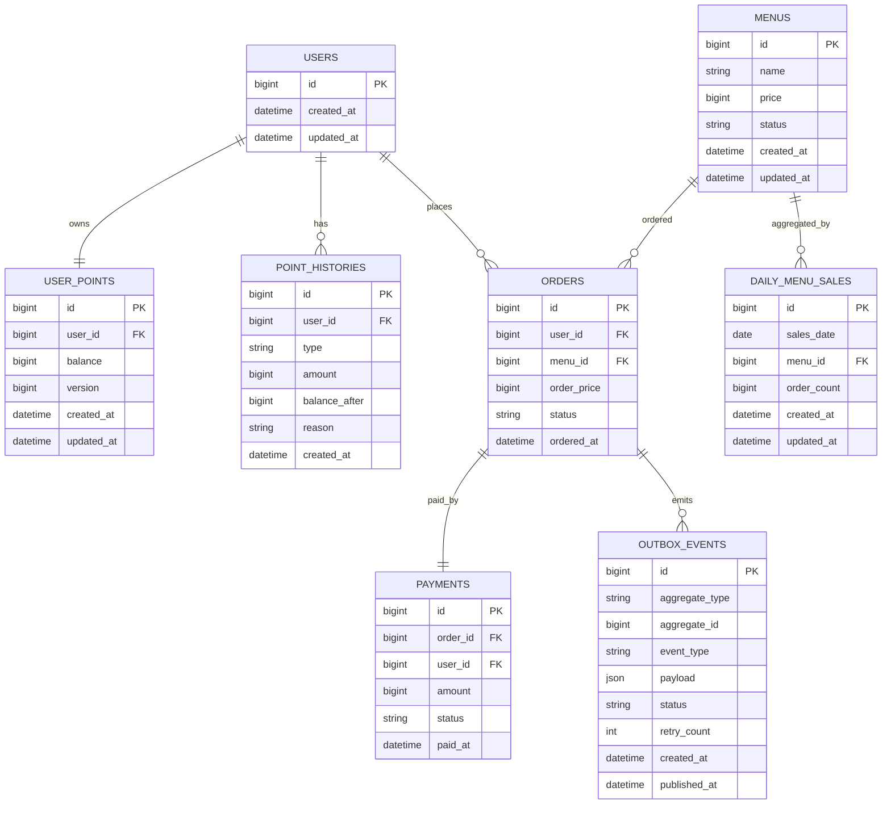
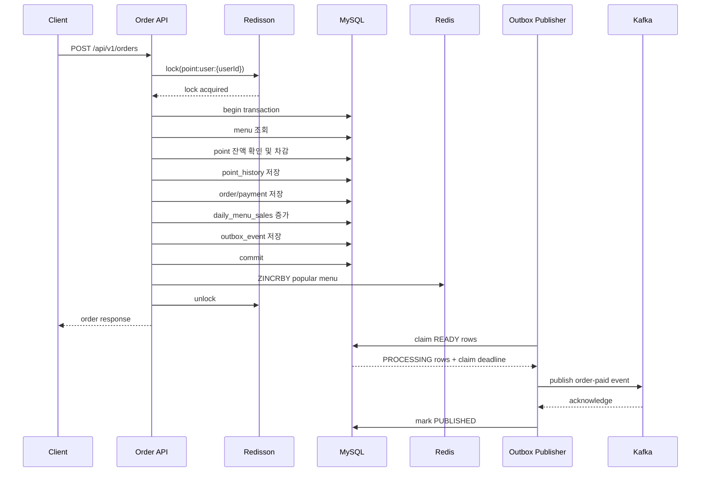

# Coffee Shop Order System

> 현재 문서는 구현 전 설계 기준을 정리한 문서이며, 제품 기능 구현은 이후 단계에서 진행합니다.

다수 서버 환경에서도 안정적으로 동작하는 커피숍 주문 시스템을 설계하고 구현한다.

이 과제의 핵심은 API 구현 자체보다, 동시성, 데이터 일관성, 확장성 관점에서 어떤 선택을 했고 왜 그 선택이 적절한지 설명하는 것이다. 따라서 본 프로젝트는 기능 요구사항뿐 아니라 설계 의도, 대안 비교, 기술 선택 이유를 문서와 코드에 함께 남긴다.

## 1. 요구사항 요약

### 필수 API

| API | 설명 |
|---|---|
| 커피 메뉴 목록 조회 | 메뉴 ID, 이름, 가격을 조회한다. |
| 포인트 충전 | 사용자 식별값과 충전 금액을 받아 포인트를 충전한다. 1원은 1P로 계산한다. |
| 커피 주문/결제 | 사용자 식별값과 메뉴 ID를 받아 주문을 생성하고 포인트로 결제한다. |
| 인기 메뉴 조회 | 최근 7일간 주문 횟수가 많은 메뉴 3개를 조회한다. |

### 도전 요구사항

- 다수 서버 인스턴스 환경에서도 기능이 깨지지 않아야 한다.
- 포인트 충전/차감과 주문 생성에서 동시성 이슈를 고려한다.
- 주문, 결제, 이벤트 전송, 인기 메뉴 집계의 데이터 일관성을 고려한다.
- 각 기능과 제약사항에 대한 테스트를 작성한다.

## 2. 기술 스택

| 영역 | 선택 |
|---|---|
| Backend | Spring Boot |
| Language | Java |
| Java Version | 21 |
| Spring Boot Version | 4.1.0 |
| Build Tool | Gradle |
| Base Package | `com.ch6.cafe` |
| Persistence | Spring Data JPA, QueryDSL |
| Database | MySQL |
| Distributed Lock | Redisson |
| Cache / Ranking | Redis Sorted Set |
| Event Streaming | Kafka |
| Reliability Pattern | Transactional Outbox |
| Test | JUnit 5, Spring Boot Test, Testcontainers |

런타임은 로드밸런서 뒤 stateless API 다중 인스턴스를 전제로 한다. 패키지는 `com.ch6.cafe.global`과 `com.ch6.cafe.domain.{menu,point,order,ranking,outbox}` 아래에서 도메인별 `controller -> service -> repository` 방향을 사용한다. 상세 토폴로지는 [시스템 아키텍처](docs/06-system-architecture.md), 패키지 결정은 [ADR-004](adr/ADR-004-domain-packages-three-layer.md), 부하·장애·측정 계획은 [품질 및 운영 규칙](docs/09-quality-operations-and-rules.md)을 따른다.

## 3. 기술 선택 이유

### Spring Boot

Spring Boot는 REST API, 트랜잭션, JPA, Kafka, Redis 연동을 안정적으로 지원한다. 과제의 핵심이 프레임워크 자체 구현이 아니라 주문/결제 도메인의 일관성 보장이므로, 검증된 생태계를 활용해 비즈니스 로직과 장애 대응 전략에 집중한다.

### JPA + QueryDSL

기본적인 메뉴, 포인트, 주문 저장은 JPA Repository로 충분하다. JPA는 엔티티 중심으로 도메인 상태 변경을 표현하기 좋고, 트랜잭션 경계 안에서 변경 감지를 활용할 수 있다.

다만 인기 메뉴 조회, 기간 조건, 집계성 조회처럼 조건이 늘어날 수 있는 영역은 QueryDSL을 사용한다. 문자열 기반 JPQL보다 타입 안정성이 높고, 동적 조건을 조합하기 쉬워 유지보수성이 좋다.

### MySQL

과제 조건상 DB는 MySQL을 사용한다. 주문, 결제, 포인트 이력, Outbox 이벤트는 정합성이 중요한 데이터이므로 Redis나 Kafka만을 source of truth로 두지 않는다. MySQL을 기준 저장소로 사용하고, Redis와 Kafka는 조회 성능 및 비동기 전송을 위한 보조 컴포넌트로 둔다.

### Redisson Distributed Lock

DB 비관적 락도 공용 MySQL을 통해 다중 인스턴스에서 유효하다. Redisson은 DB 진입 전에 같은 사용자 요청의 경합을 제어하고 짧은 획득 timeout을 적용하기 위해 선택한다. MySQL 트랜잭션과 제약은 최종 정합성 경계로 유지한다.

이 선택은 Redis 의존성, lease 만료, watchdog 중단, Redis와 MySQL의 이중 장애 경계를 추가한다. 따라서 동일한 일반 부하·hot key·충전/주문 경합을 DB 비관적 락과 비교해 DB pool 압력과 tail latency 개선이 비용을 정당화하는지 검증한다. 상세 결정과 검증 조건은 [ADR-001](adr/ADR-001-redisson-distributed-lock.md)에 있다.

### Transactional Outbox

주문, 결제, 포인트 이력과 Outbox 이벤트를 같은 MySQL 트랜잭션에 저장한다. 여러 Publisher 인스턴스는 `READY` row를 짧은 트랜잭션으로 claim하고, 장애로 만료된 claim은 다시 회수한다. Kafka 발행 성공 후 상태 기록 전에 장애가 나면 중복 발행될 수 있으므로 event ID 기반 consumer 멱등성이 필수다.

### Kafka

Kafka는 Outbox와 별개의 선택이다. 이벤트 보존과 replay, 여러 consumer group의 독립 소비, partition 병렬화, 같은 partition key의 순서 보존이 필요해 선택한다. consumer 인스턴스 장애 시 group rebalance가 partition을 동적으로 재할당한다. replay가 필요 없고 짧은 작업 전달, 우선순위, 복잡한 routing이 중심이면 RabbitMQ 같은 메시지 큐가 더 적합할 수 있다. 두 선택의 상세 근거와 trade-off는 [ADR-002](adr/ADR-002-transactional-outbox-kafka.md)에 있다.

### Redis Sorted Set + 일별 집계 테이블

인기 메뉴는 최근 7일간 주문 횟수가 정확해야 한다. 단순히 주문 테이블을 매 요청마다 `GROUP BY`로 집계할 수도 있지만, 주문량이 늘어나면 인기 메뉴 조회 API의 비용이 커진다.

고려한 선택지는 다음과 같다.

| 선택지 | 장점 | 한계 |
|---|---|---|
| 주문 테이블 직접 집계 | 구현이 단순하고 정합성이 높다. | 요청마다 집계 비용이 발생한다. 데이터가 많아질수록 느려진다. |
| Redis Sorted Set만 사용 | 조회가 빠르다. | Redis 장애나 유실 시 복구 기준이 약하다. |
| 일별 집계 테이블만 사용 | DB 기준으로 정합성 검증이 쉽다. | 실시간 랭킹 조회 성능은 Redis보다 낮을 수 있다. |
| Redis Sorted Set + 일별 집계 테이블 | 빠른 조회와 복구 가능성을 함께 가진다. | 쓰기 경로와 보정 작업이 추가된다. |

본 프로젝트는 주문 성공 시 Redis Sorted Set에 메뉴 주문 횟수를 반영하고, MySQL의 `daily_menu_sales`에도 일별 주문 횟수를 누적한다. 인기 메뉴 조회는 Redis를 우선 사용하고, Redis 장애 또는 데이터 불일치 시 MySQL 일별 집계 테이블을 기준으로 복구할 수 있게 설계한다.

Redis Sentinel은 현재 확정 구현이 아니라 향후 master 장애 자동 전환 대안이다. Sentinel은 sharding이나 쓰기 부하 분산 수단이 아니다. 상세 범위는 [ADR-003](adr/ADR-003-redis-sorted-set-daily-aggregation.md)에 있다.

## 4. 도메인 모델



## 5. API 명세

### 5.1 커피 메뉴 목록 조회

`GET /api/v1/menus`

Response:

```json
{
  "menus": [
    {
      "id": 1,
      "name": "Americano",
      "price": 4500
    }
  ]
}
```

### 5.2 포인트 충전

`POST /api/v1/users/{userId}/points/charge`

이 과제는 로그인 기능을 구현하지 않는다. 여기서 `userId`는 로그인 사용자가 아니라 포인트 계정을 구분하기 위한 과제용 사용자 식별값이다.

Request:

```json
{
  "amount": 10000
}
```

Response:

```json
{
  "userId": 1,
  "chargedAmount": 10000,
  "balance": 15000
}
```

### 5.3 커피 주문/결제

`POST /api/v1/orders`

주문 API의 `userId`도 인증 principal이 아니라 과제 요구사항의 사용자 식별값이다. 실제 서비스라면 로그인된 사용자와 요청 userId가 일치하는지 서버에서 검증해야 한다.

Request:

```json
{
  "userId": 1,
  "menuId": 10
}
```

Response:

```json
{
  "orderId": 100,
  "userId": 1,
  "menuId": 10,
  "paymentAmount": 4500,
  "remainingPoint": 10500,
  "status": "PAID"
}
```

### 5.4 인기 메뉴 목록 조회

`GET /api/v1/menus/popular?days=7&limit=3`

Response:

```json
{
  "periodDays": 7,
  "menus": [
    {
      "menuId": 10,
      "name": "Americano",
      "price": 4500,
      "orderCount": 120
    }
  ]
}
```

## 6. 주문/결제 처리 흐름



## 7. 동시성 제어 전략

포인트 잔액은 사용자 단위로 보호한다. 같은 사용자가 동시에 여러 주문을 요청하거나 충전과 주문을 동시에 요청하는 경우, 잔액 계산이 꼬이지 않도록 Redisson 분산락을 획득한 뒤 트랜잭션을 시작한다.

락 정책:

- Lock key: `point:user:{userId}`
- wait time: 짧게 설정하여 장시간 대기 요청을 방지한다.
- lease/watchdog: 기준 테스트와 장애 주입 후 하나의 정책을 명시한다. lease 만료나 watchdog 중단이 안전을 보장하지 않으므로 DB 정합성 검증을 유지한다.
- unlock: 반드시 `finally`에서 수행한다.

DB 트랜잭션은 다음 작업을 하나의 원자적 단위로 묶는다.

- 포인트 잔액 변경
- 포인트 이력 저장
- 주문 생성
- 결제 저장
- 일별 메뉴 집계 증가
- Outbox 이벤트 저장

## 8. 데이터 일관성 전략

### 포인트 일관성

포인트 잔액만 저장하면 장애 상황에서 추적이 어렵다. 따라서 `user_points`에는 현재 잔액을 저장하고, `point_histories`에는 충전과 사용 이력을 모두 저장한다. 장애 분석이나 보정이 필요할 때 이력 기반으로 잔액을 검증할 수 있다.

### 주문 이벤트 일관성

주문 이벤트는 Outbox 테이블에 먼저 저장한다. Kafka 발행은 별도 프로세스가 담당한다. 이를 통해 주문 트랜잭션 성공과 이벤트 발행 대상 저장을 같은 MySQL 트랜잭션에 묶는다.

### 인기 메뉴 일관성

Redis Sorted Set은 빠른 조회를 위한 자료구조다. 정확성 검증과 복구 기준은 MySQL의 `daily_menu_sales`가 담당한다. Redis 데이터가 유실되면 최근 7일간의 `daily_menu_sales`를 읽어 Redis Sorted Set을 재구성한다.

## 9. 테스트 전략

| 테스트 | 검증 내용 |
|---|---|
| 메뉴 조회 테스트 | 판매 중인 메뉴 목록이 가격과 함께 조회되는지 검증한다. |
| 포인트 충전 테스트 | 충전 금액 검증, 잔액 증가, 이력 저장을 검증한다. |
| 주문/결제 테스트 | 포인트 차감, 주문 생성, 결제 저장, 잔액 부족 실패를 검증한다. |
| 동시성 테스트 | 동일 사용자에 대한 다중 주문 요청 시 잔액이 음수가 되지 않는지 검증한다. |
| Outbox 테스트 | 주문 성공 시 Outbox 이벤트가 저장되는지 검증한다. |
| Kafka 발행 실패 테스트 | 발행 실패 시 Outbox 이벤트가 재시도 대상으로 남는지 검증한다. |
| 인기 메뉴 테스트 | 최근 7일 기준 TOP 3가 정확히 계산되는지 검증한다. |
| Redis 복구 테스트 | Redis 데이터 유실 시 일별 집계 테이블로 랭킹을 복구할 수 있는지 검증한다. |

필수 정합성 조건은 [도메인 모델의 Consistency Invariants](docs/03-domain-model.md#consistency-invariants)가 소유한다. 일반 부하, hot key, 충전/주문 경합, Outbox backlog, API·Redis·Kafka 장애 복구와 처리량·p50/p95/p99·오류율·lock wait·DB pool·Outbox 체류시간·consumer lag 측정 계획은 [품질 및 운영 규칙](docs/09-quality-operations-and-rules.md)에 있다. TPS와 p95 목표 수치는 기준 테스트 결과 후 확정한다.

## 10. 문서 구조

```txt
AGENTS.md
README.md

docs/
  00-index.md
  01-product-vision.md
  02-users-and-permissions.md
  03-domain-model.md
  04-user-flows.md
  05-functional-requirements.md
  06-system-architecture.md
  07-data-and-api-contracts.md
  08-ui-and-frontend-guidelines.md
  09-quality-operations-and-rules.md

ai/
  agent.rules.md
  subagent-workflow.md
  verification-levels.md
  qa-gate.md
  done-claim-template.md
  implementation-guardrails.md
  issue-completion-checklist.md
  reviewer-checklist.md
  agent-mistakes.md
  remove-ai-slop.md
  lazycodex-runbook.md

specs/
  _template/
    spec.md
    plan.md
    tasks.md
    checklist.md
    decisions.md
  001-menu-query/
  002-point-charge/
  003-order-payment/
  004-popular-menu/

adr/
  ADR-000-template.md
  ADR-001-redisson-distributed-lock.md
  ADR-002-transactional-outbox-kafka.md
  ADR-003-redis-sorted-set-daily-aggregation.md
  ADR-004-domain-packages-three-layer.md
```

## 11. 기능별 상세 문서

- 메뉴 목록 조회: `specs/001-menu-query`
- 포인트 충전: `specs/002-point-charge`
- 주문/결제: `specs/003-order-payment`
- 인기 메뉴 조회: `specs/004-popular-menu`
