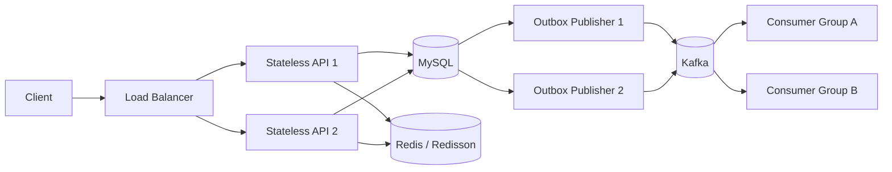

# 06. 시스템 아키텍처

## 기술 스택

과제 설계에서 확인된 항목:

- 백엔드: Spring Boot
- Spring Boot 버전: `4.1.0`
- 빌드 도구: Gradle
- Java 버전: `21`
- 기본 패키지: `com.ch6.cafe`
- 영속성: Spring Data JPA
- 동적 쿼리 선택지: QueryDSL
- 데이터베이스: MySQL
- 분산 락: Redisson
- 랭킹/캐시: Redis Sorted Set
- 이벤트 스트리밍: Kafka
- 신뢰성 패턴: Transactional Outbox

Gradle 플러그인 기준선:

```gradle
plugins {
    id 'java'
    id 'org.springframework.boot' version '4.1.0'
    id 'io.spring.dependency-management' version '1.1.7'
}
```

## 런타임 토폴로지

API는 stateless이며 로드 밸런서 뒤에서 서로 교체 가능한 여러 인스턴스로 실행된다. 어떤 정합성 규칙도 메모리 내 세션 상태, JVM 로컬 스케줄러 소유권 또는 JVM 로컬 락에 의존해서는 안 된다.



- 로드 밸런서는 모든 요청을 정상 API 인스턴스 어디로든 보낼 수 있다.
- 포인트 변경 조정은 Redisson과 MySQL 외부에 두며, API는 stateless로 유지한다.
- Outbox Publisher 인스턴스는 DB 행을 claim하므로 작업을 특정 프로세스에 정적으로 배정하지 않는다.
- Kafka consumer group은 활성 consumer에 파티션을 배정한다. consumer가 중단되면 리밸런싱과 동적 파티션 재배정이 일어난다.

## 애플리케이션 구조

패키지 구조는 제안이 아닌 확정 사항이다.

```txt
com.ch6.cafe
├─ global
│  ├─ config
│  ├─ exception
│  ├─ response
│  └─ lock
└─ domain
   ├─ menu
   ├─ point
   ├─ order
   ├─ ranking
   └─ outbox
```

도메인 내부에는 실제 클래스에 필요한 패키지만 만든다: `controller`, `service`, `repository`, `entity`, `dto/request`, `dto/response`, `exception`.

- Kafka Publisher 클래스는 `domain/outbox/publisher`에 둔다.
- 결제는 현재 범위에서 독립 수명 주기가 없으므로 `domain/order`에 둔다.
- 트리를 미리 만들기 위해 빈 패키지나 자리표시자 파일을 만들지 않는다.

## 계층 책임

### controller

- HTTP 요청/응답 매핑
- 요청 검증
- 오류 응답 매핑
- 비즈니스 규칙 없음

### service

- 비즈니스 규칙 및 유스케이스 오케스트레이션
- MySQL 트랜잭션 경계
- 분산 락 획득 및 해제 오케스트레이션
- repository와 외부 클라이언트 간 조정

### repository

- JPA 및 QueryDSL 영속성 접근
- service가 요청한 조회와 갱신 작업
- HTTP 매핑 또는 비즈니스 워크플로 소유 금지

### 지원 패키지

- `entity`: 영속 도메인 상태 및 자체 불변식
- `dto/request`, `dto/response`: 전송 계층 전용 입출력 모델
- `exception`: 도메인 전용 실패
- `global`: 공통 설정, 오류/응답 정책, 락 유틸리티만 포함

## 의존성 방향

```txt
controller -> service -> repository
```

controller는 repository에 직접 접근하지 않는다. service는 비즈니스 규칙과 트랜잭션을 소유한다. 도메인 간 호출은 의존성 순환을 만들면 안 된다. 공통 기술 동작은 `global`에 두고, 비즈니스 동작은 소유 도메인에 남긴다.

## 분산 처리와 장애 경계

### 포인트 변경

Redisson은 DB 진입 전의 진입 제어 계층이며 MySQL 정합성을 대체하지 않는다. DB 비관적 락도 여러 API 인스턴스에서 유효하다. 선택지는 락 대기와 DB 풀 압력을 포함한 동일 경합 조건에서 비교해야 한다. Redis 사용 불가, lease 만료, watchdog 중단, Redis/MySQL 결합 장애 경계는 [ADR-001](../adr/ADR-001-redisson-distributed-lock.md)에 정의한다.

### Outbox 발행

Publisher worker는 각 발행 시도 직전에 짧은 트랜잭션으로 최대 하나의 행을 claim하고, 고유 claim token·소유자·마감 시각 메타데이터와 함께 `PROCESSING`으로 표시한 다음 claim이 커밋된 뒤 발행한다. 설정된 주기는 이 순서를 반복할 수 있으나, 이후 시작하지 않은 행을 미리 lease하지 않는다. 상태 갱신에는 현재 claim token이 필요하며, 인스턴스 장애 후 재배정되는 만료 claim에는 새 token을 부여한다. 발행은 여전히 at least once다. Kafka 확인 이후 `PUBLISHED` 이전의 실패는 중복을 만들 수 있으므로 불변 이벤트 ID를 consumer 멱등성 키로 사용한다.

### Kafka 소비

Kafka는 보존 및 재생, 여러 독립 consumer group, 파티션 병렬성, 파티션 내 순서를 위해 Transactional Outbox와 별도로 선택했다. consumer 인스턴스가 참여하거나 실패하면 파티션 소유권이 동적으로 재배정된다. 안정적인 파티션 키는 키별 순서만 보존하며 파티션 간 전역 순서는 없다. 짧은 수명의 작업 전달, 풍부한 라우팅, 우선순위 또는 재생과 여러 consumer group이 필요 없는 단일 consumer 작업에는 RabbitMQ 또는 다른 작업 큐가 더 적합할 수 있다. 전체 트레이드오프는 [ADR-002](../adr/ADR-002-transactional-outbox-kafka.md)에 있다.

구현된 로컬 분석 consumer는 `(consumer_group, event_id)` 마커와 `order_paid_analytics` 효과를 하나의 MySQL 트랜잭션으로 커밋한다. 같은 group의 중복 전달은 두 번째 마커나 두 번째 효과를 만들지 않으며, 분석 쓰기 실패는 마커를 재시도를 위해 롤백한다.

### Redis 가용성

Redis Sentinel은 향후 자동 master failover 선택지이며 확정된 구현이 아니다. Sentinel은 데이터를 샤딩하거나 쓰기 부하를 분산하지 않는다. 현재 랭킹 복구 원본은 MySQL `daily_menu_sales`이며, [ADR-003](../adr/ADR-003-redis-sorted-set-daily-aggregation.md)를 참조한다.

## 금지 패턴

- controller의 비즈니스 로직
- UI 컴포넌트의 비즈니스 규칙
- Outbox 이벤트 저장 대신 주문 트랜잭션 내부에서 Kafka 직접 발행
- 다중 인스턴스 포인트 정합성을 위한 JVM 로컬 락
- Redis 락 상태를 알 수 없을 때 Redisson을 우회하여 포인트 변경 계속 진행
- Redis를 인기 메뉴 수의 유일한 정합성 기준으로 사용
- consumer 멱등성 없이 Outbox/Kafka 전달을 exactly once로 취급
- 특정 인스턴스의 Outbox 행 또는 Kafka 파티션 정적 소유
- 예외를 삼키고 성공 반환
- 명령/API 증거 없이 검증 주장

## ADR 참조

- `adr/ADR-000-template.md`
- Redisson 락 선택: [ADR-001](../adr/ADR-001-redisson-distributed-lock.md)
- Kafka Outbox 선택: [ADR-002](../adr/ADR-002-transactional-outbox-kafka.md)
- Redis Sorted Set + 일별 집계 선택: [ADR-003](../adr/ADR-003-redis-sorted-set-daily-aggregation.md)
- 도메인 패키지 + 3계층 선택: [ADR-004](../adr/ADR-004-domain-packages-three-layer.md)

## 검증 경계

기준 `ai/project-state.json`은 선택한 프레임워크 버전으로 Spring Boot `4.1.0`을 기록한다. 이 문서 작업에서는 런타임 의존성 해석을 실행하지 않았으며, 지원되는 프로젝트 명령 경로가 증거를 기록할 때까지 `NOT RUN`으로 보고해야 한다.
