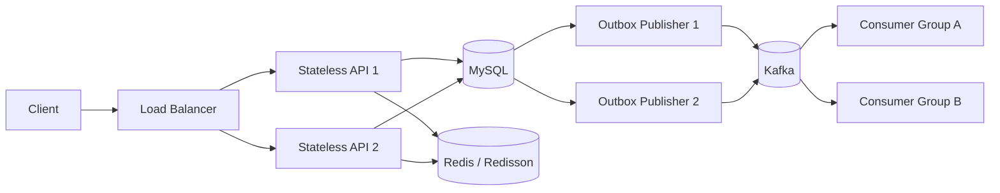

# 06. System Architecture

## Tech Stack

Confirmed for assignment design:

- Backend: Spring Boot
- Spring Boot version: `4.1.0`
- Build tool: Gradle
- Java version: `21`
- Base package: `com.ch6.cafe`
- Persistence: Spring Data JPA
- Dynamic query option: QueryDSL
- Database: MySQL
- Distributed lock: Redisson
- Ranking/cache: Redis Sorted Set
- Event streaming: Kafka
- Reliability pattern: Transactional Outbox

Gradle plugin baseline:

```gradle
plugins {
    id 'java'
    id 'org.springframework.boot' version '4.1.0'
    id 'io.spring.dependency-management' version '1.1.7'
}
```

## Runtime Topology

The API is stateless and runs as multiple interchangeable instances behind a load balancer. No correctness rule may depend on in-memory session state, a JVM-local scheduler owner, or a JVM-local lock.



- The load balancer can send any request to any healthy API instance.
- Point mutation coordination is externalized to Redisson and MySQL; the API remains stateless.
- Outbox Publisher instances claim DB rows so work is not statically assigned to a process.
- Kafka consumer groups assign partitions to active consumers. A stopped consumer triggers rebalancing and dynamic partition reassignment.

## Application Structure

The package structure is confirmed, not suggested:

```txt
com.ch6.cafe
├─ global
│  ├─ config
│  ├─ exception
│  ├─ response
│  └─ lock
└─ domain
   ├─ menu
   ├─ point
   ├─ order
   ├─ ranking
   └─ outbox
```

Within a domain, create only the packages needed by actual classes: `controller`, `service`, `repository`, `entity`, `dto/request`, `dto/response`, and `exception`.

- Kafka Publisher classes belong in `domain/outbox/publisher`.
- Payment remains in `domain/order` because it has no independent lifecycle in the current scope.
- Do not create empty packages or placeholder files to pre-build the tree.

## Layer Responsibilities

### controller

- HTTP request/response mapping
- Request validation
- Error response mapping
- No business rules

### service

- Business rules and use-case orchestration
- MySQL transaction boundaries
- Distributed lock acquisition and release orchestration
- Coordination between repositories and external clients

### repository

- JPA and QueryDSL persistence access
- Query and update operations requested by services
- No HTTP mapping or business workflow ownership

### Supporting packages

- `entity`: persistent domain state and local invariants
- `dto/request`, `dto/response`: transport-specific input and output models
- `exception`: domain-specific failures
- `global`: shared configuration, error/response policy, and lock utilities only

## Dependency Direction

```txt
controller -> service -> repository
```

Controllers never access repositories directly. Services own business rules and transactions. Cross-domain calls must not create dependency cycles; shared technical behavior belongs in `global`, while business behavior stays in its owning domain.

## Distributed Processing and Failure Boundaries

### Point mutation

Redisson is an admission-control layer before DB entry, not a replacement for MySQL consistency. A DB pessimistic lock is also valid across multiple API instances. The choice must be compared under identical contention, including lock wait and DB-pool pressure. Redis unavailability, lease expiry, watchdog interruption, and the combined Redis/MySQL failure boundary are specified in [ADR-001](../adr/ADR-001-redisson-distributed-lock.md).

### Outbox publication

Publisher workers claim a bounded batch of `READY` rows in a short transaction, mark the rows `PROCESSING` with a unique claim token, owner, and deadline metadata, and publish after the claim commits. State updates require the current claim token, and expired claims receive a new token when reassigned after an instance failure. Publishing is still at least once: failure after Kafka acknowledgement and before `PUBLISHED` can create a duplicate, so the immutable event ID is the consumer idempotency key.

### Kafka consumption

Kafka was selected separately from Transactional Outbox for retention and replay, multiple independent consumer groups, partition parallelism, and ordering within a partition. Partition ownership is dynamically reassigned when consumer instances join or fail. A stable partition key preserves only per-key order; there is no global order across partitions. RabbitMQ or another work queue can be a better fit for short-lived task delivery, rich routing, priorities, or single-consumer work where replay and multiple consumer groups are unnecessary. Full trade-offs are in [ADR-002](../adr/ADR-002-transactional-outbox-kafka.md).

### Redis availability

Redis Sentinel is a future automatic master-failover option, not a confirmed implementation. Sentinel does not shard data or distribute write load. The current ranking recovery source remains MySQL `daily_menu_sales`; see [ADR-003](../adr/ADR-003-redis-sorted-set-daily-aggregation.md).

## Forbidden Patterns

- Business logic in controller
- Business rules in UI components
- Direct Kafka publish inside order transaction instead of Outbox event save
- JVM local lock for multi-instance point consistency
- Bypassing Redisson and continuing a point mutation when Redis lock state is unknown
- Redis as the only source of truth for popular menu counts
- Treating Outbox/Kafka delivery as exactly once without consumer idempotency
- Static ownership of Outbox rows or Kafka partitions by a particular instance
- Swallowing exceptions and returning success
- Claiming verification without command/API evidence

## ADR References

- `adr/ADR-000-template.md`
- Redisson lock choice: [ADR-001](../adr/ADR-001-redisson-distributed-lock.md)
- Kafka Outbox choice: [ADR-002](../adr/ADR-002-transactional-outbox-kafka.md)
- Redis Sorted Set + daily aggregate choice: [ADR-003](../adr/ADR-003-redis-sorted-set-daily-aggregation.md)
- Domain packages + three-layer choice: [ADR-004](../adr/ADR-004-domain-packages-three-layer.md)

## Verification Boundary

Canonical `ai/project-state.json` records Spring Boot `4.1.0` as the selected framework version. Runtime dependency resolution was not executed as part of this documentation work and must remain reported as `NOT RUN` until a supported project-command path records evidence.
